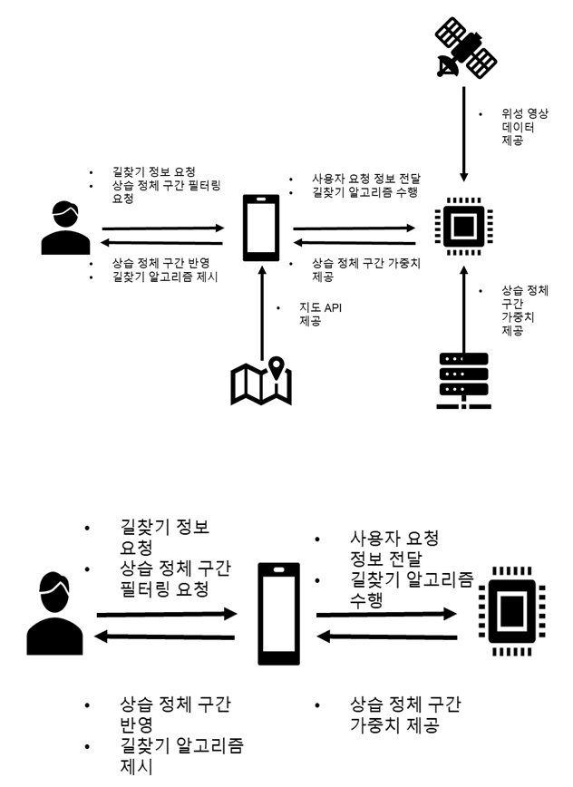
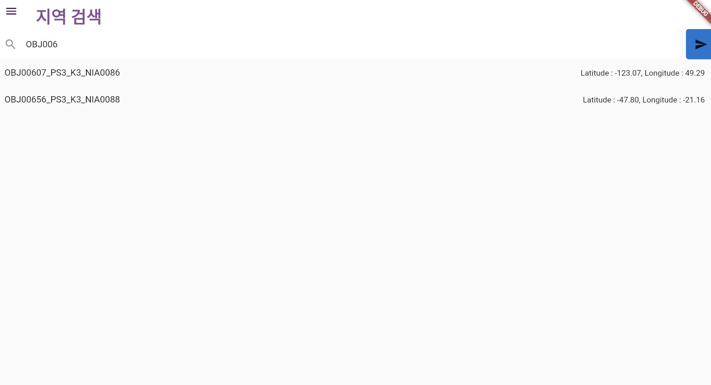
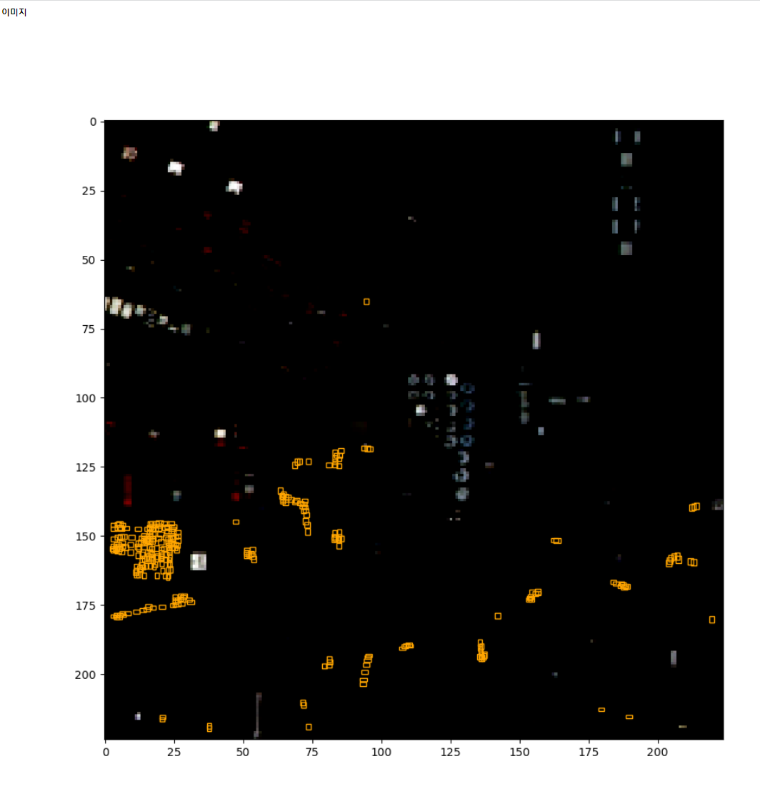
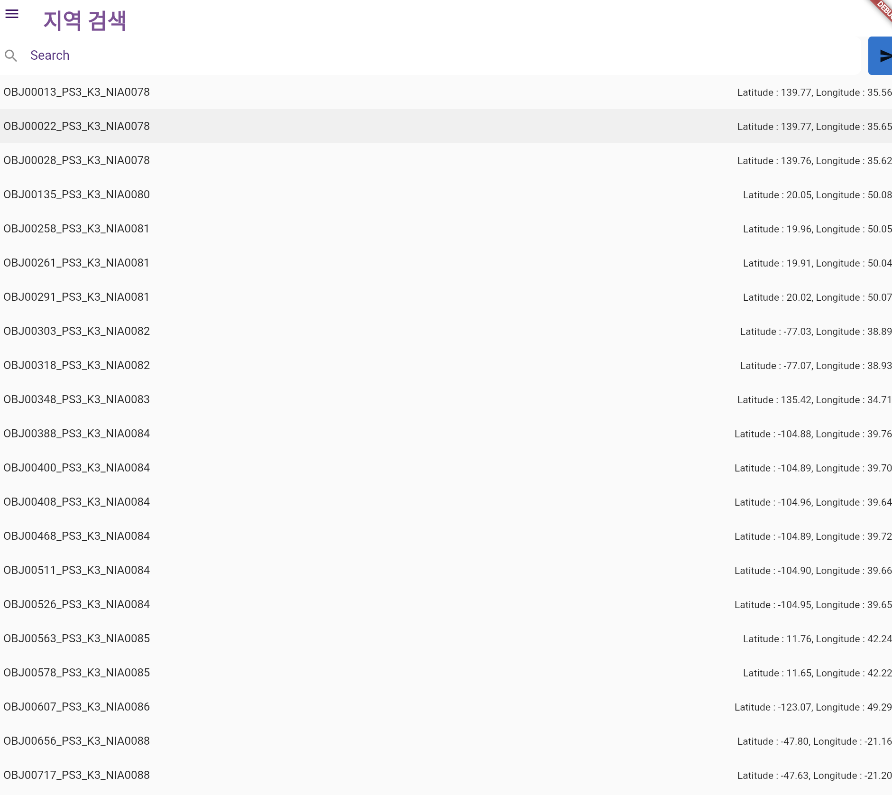

# Hanium Ojbect Detection on Satellite Image

Members: 김예진, 장덕민, 전은지, 박슬기

## Overview

## Dataset

Original Dataset is [link](https://aihub.or.kr/aihubdata/data/view.do?currMenu=115&topMenu=100&aihubDataSe=realm&dataSetSn=73).

You can see more details in the link about how this dataset has made up and processed. 

Target classes of interest are Bus, Truck and small vehicle among whole classes. 

## Sample 

[Youtube Link](https://youtube.com/shorts/rJyyP-Jv9qg?feature=share)

